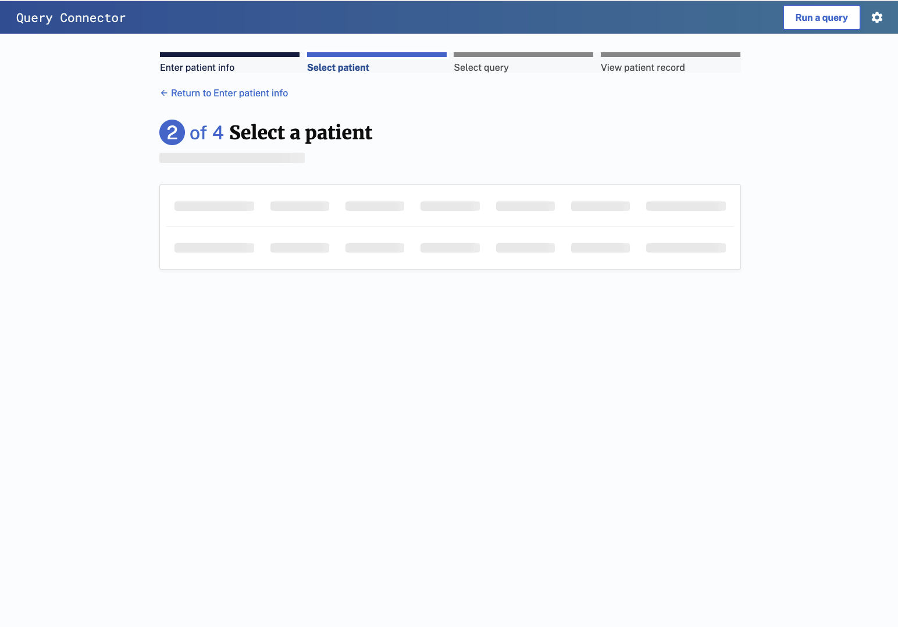
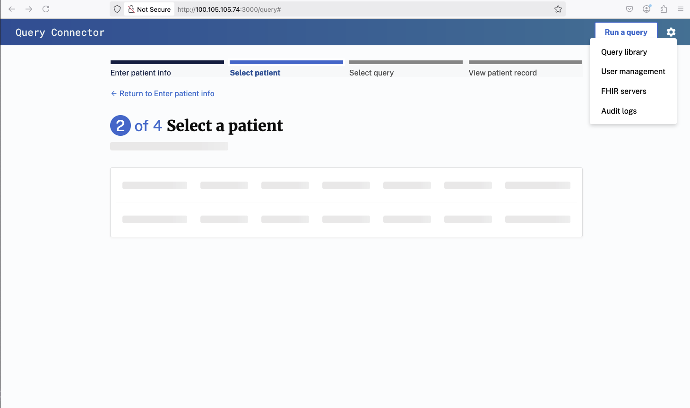
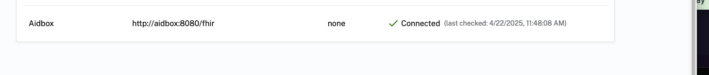

### Development Database Disclaimer

This virtual machine image includes a database intended **for development purposes only**.  
It is **not configured for production use** and should not be used to store sensitive or live data.  
Performance, security, and reliability settings may differ from production environments.  

**Use this database only for testing and development.**


### Query Connector Data for Query Building

When initializing the backend database for the first time, the Query Connector makes the value sets associated with 200+ reportable conditions available to users tasked with building queries for their jurisdiction. To run this seeding script, you'll need to obtain the UMLS and eRSD API key's using the instructions below.

To group value sets by condition and to group the conditions by type, the Query Connector obtains and organizes data from the eRSD and the VSAC in the following way:

1. The Query Connector retrieves the 200+ reportable conditions from the eRSD as well as the value sets' associated IDs.
2. Using the value set IDs from the eRSD, the Query Connector retrieves the value set's comprehensive information from the VSAC, i.e., the LOINC, SNOMED, etc. codes associated with each value set ID.
3. The Query Connector then organizes these value sets according to the conditions with which they're associated, making the result available to users interested in building queries. The conditions are additionally organized by category, e.g., sexually transmitted diseases or respiratory conditions, using a mapping curated by HLN Consulting.


#### Obtaining an eRSD API Key, UMLS API Key, and aidbox license

To obtain the free API keys and aidbox license, please visit the following URLs and follow the sign up instructions.

- [https://ersd.aimsplatform.org/#/api-keys](https://ersd.aimsplatform.org/#/api-keys)
- [https://uts.nlm.nih.gov/uts/login](https://uts.nlm.nih.gov/uts/login)
- [https://aidbox.app/](https://aidbox.app/)


Save your API keys and license to input during the wizard script , the environment variabels are  called `ERSD_API_KEY`, `UMLS_API_KEY`, and `AIDBOX_LICENSE`. The wizard will assit you with updating these values for the `.env` file so that they can be accessed when running the Query Connector app. 

Adjust your `DATABASE_URL` as needed.

### Setup wizard script for Query Connector Application
1. Logon to the virtual machine
2. Run the wizard script to setup the Query Connector application:
    ```bash
    ./dibbs-query-connector-wizard.sh
    ```
3. Navigate to following urls:
    - Query Connector at <IP.ADDRESS>:3000
    - Portainer at <IP.ADDRESS>:9000
    - Aidbox server at <IP.ADDRESS>:8080


### Common Troubleshooting steps

1. If the Select a patient page is stalling on populating a patient as shown in the image below:



a. Navigate to FHIR servers



b.Ensure at the bottom of the screen that Aidbox server is present and connected

