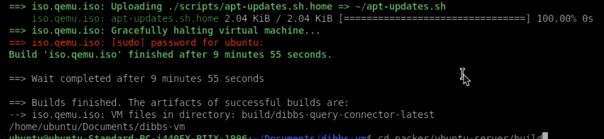

### Development Database Disclaimer

This virtual machine image includes a database intended **for development purposes only**.  
It is **not configured for production use** and should not be used to store sensitive or live data.  
Performance, security, and reliability settings may differ from production environments.  

**Use this database only for testing and development.**


### Query Connector Data for Query Building

When initializing the backend database for the first time, the Query Connector makes the value sets associated with 200+ reportable conditions available to users tasked with building queries for their jurisdiction. To run this seeding script, you'll need to obtain the UMLS and eRSD API key's using the instructions below.

To group value sets by condition and to group the conditions by type, the Query Connector obtains and organizes data from the eRSD and the VSAC in the following way:

1. The Query Connector retrieves the 200+ reportable conditions from the eRSD as well as the value sets' associated IDs.
2. Using the value set IDs from the eRSD, the Query Connector retrieves the value set's comprehensive information from the VSAC, i.e., the LOINC, SNOMED, etc. codes associated with each value set ID.
3. The Query Connector then organizes these value sets according to the conditions with which they're associated, making the result available to users interested in building queries. The conditions are additionally organized by category, e.g., sexually transmitted diseases or respiratory conditions, using a mapping curated by HLN Consulting.

#### Query Building Data in `dev` mode

In order to make the dev process as low-lift as possible, we want to avoid executing the `db-creation` scripts when booting up the application in dev mode via `npm run dev` or `npm run dev-win`. To that end, we've created a `pg_dump` file containing all the value sets, concepts, and foreign key mappings that would be extracted from a fresh pull of the eRSD and processed through our creation functions. This file, `vs_dump.sql` has been mounted into the docker volume of our postgres DB when running in dev mode as an entrypoint script. This means it will be automatically executed when the DB is freshly spun up. You shouldn't need to do anything to facilitate this mounting or file running.

#### Obtaining an eRSD API Key

Before running the Query Connector locally, you will need to obtain an API key for the electronic Reporting and Surveillance Distribution (eRSD). With the API key, you have access to 200+ pre-built queries for reportable conditions, e.g., chlamydia, influenza, hepatitis A, etc. These queries can be used and modified in the Query Connector app.
``

To obtain the free API keys, please visit the following URLs and follow the sign up instructions.

- [https://ersd.aimsplatform.org/#/api-keys](https://ersd.aimsplatform.org/#/api-keys)
- [https://uts.nlm.nih.gov/uts/login](https://uts.nlm.nih.gov/uts/login)
- [https://aidbox.app/](https://aidbox.app/)

Next, set up your `.env` file with the following command: `cp .env.sample .env`

Adjust your `DATABASE_URL` as needed.

Add your API keys as an environment variables called `ERSD_API_KEY`, `UMLS_API_KEY`, and `AIDBOX_LICENSE` in the `.env` file so that they can be accessed when running the Query Connector app.

#### How to Build Image
1. Clone the dibbs-vm  repository. 
2. Perform a `git pull` to ensure you have the latest code.
3. Run the build scripts to generate the image for Query Connector, by executing the following command:
    
    ```bash
    ./build.sh dibbs-query-connector <version> 
    ```
    
4. Once the build is complete, the script will display a message like the one below. Please note that the duration may vary depending on the build location and available resources



### Setup wizard script for Query Connector
1. Logon to the virtual machine
2. Run the wizard script to setup the Query Connector application:
    ```bash
    ./dibbs-query-connector-wizard.sh
    ```
3. Navigate to following urls:
    - Query Connector at <IP.ADDRESS>:3000
    - Portainer at <IP.ADDRESS>:9000
    - Aidbox server at <IP.ADDRESS>:8080